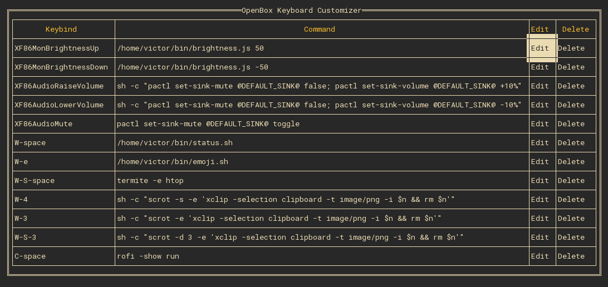

# obkbc

A Terminal User Interface for managing keyboard combinations of the OpenBox window manager!

## Installation

Get the repo and use go build or go install:

```
$ git clone https://github.com/vityavv/obkbc
$ cd obkbc
$ go build
$ obkbc
```

Alternatively, you can download a [release](https://github.com/vityavv/obkbc/releases).

## Useage

To use `obkbc`, you should have an `rc.xml` file in `$HOME/.config/openbox/`, and you should have the `HOME` environment variable defined (most shells or operating systems do this). Once the program is built, run it with `obkbc`. You will see a table of keyboard combinations. From here, move the arrow keys over items you wish to edit or delete, and do so with the enter key. Press `a` to add a keyboard combination. Press `q`, Escape, or `Ctrl-C` to quit.

## Screenshot


